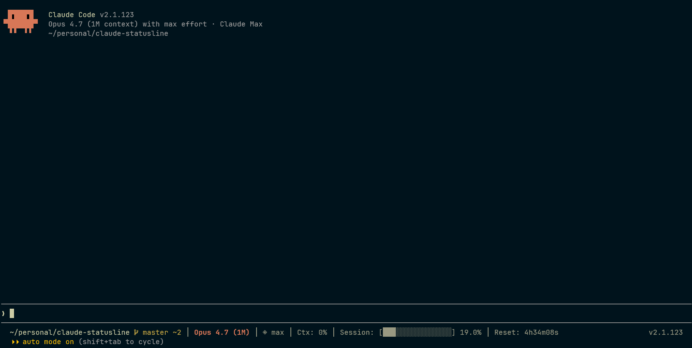

# claude-statusline

A custom status line for [Claude Code](https://github.com/anthropics/claude-code), written in Go. One file, no dependencies, easy to fork and tweak.



## Segments

Left to right, empty segments drop out cleanly:

| Segment | Source | Notes |
|---------|--------|-------|
| Path | `workspace.current_dir` | 5-level abbreviation, capped at 40 runes |
| Git | `git status --porcelain=v1` | Branch + `?N` untracked / `~N` modified / `-N` deleted |
| Model | `model.display_name` | Trims `(default)`, shortens `(1M context)` → `(1M)` |
| Effort | `effort.level` | Pre-resolved by CC (`max` / `xhigh` / `high` / `medium` / `low`); hidden for Haiku |
| Ctx | `context_window.used_percentage` | Rescaled by `/ 0.8` to match CC's own indicator |
| Session | `rate_limits.five_hour.used_percentage` | 16-cell bar |
| Reset | `rate_limits.five_hour.resets_at` | Time until 5h window resets |

## Install

Requires Go 1.25+ and Claude Code 2.1.119+ (for the `effort.level` field in stdin).

### Quick (binary only)

```bash
go install github.com/leonasdev/claude-statusline@latest
```

Then in `~/.claude/settings.json` (assumes `~/go/bin` is in your `PATH`):

```json
{
  "statusLine": {
    "type": "command",
    "command": "claude-statusline",
    "refreshInterval": 1
  }
}
```

### Development (clone + auto-rebuild on edit)

```bash
git clone https://github.com/leonasdev/claude-statusline.git
cd claude-statusline
go build -o statusline .
```

Point CC at the shell wrapper instead of the binary:

```json
"command": "/absolute/path/to/claude-statusline/statusline.sh"
```

`statusline.sh` rebuilds the binary on its own when `statusline.go` is newer, so subsequent edits don't need a manual `go build`. Failed builds are logged to `build.log` (next to the script) and the previous binary keeps running.

## Customizing

The whole renderer is one file. Common tweaks:

- **Path threshold** — `pathThreshold` constant in `statusline.go` (default 40 runes).
- **Effort icons** — `effortIcons` map.
- **Colors** — `colorize()` callsites in segment renderers; ANSI codes in the `COLORS` section.
- **Add a segment** — write a `render<Name>Segment(...)` pure function, call it from `main`, append the result to the `joinSegments` slice.

Tests are pure unit tests (`go test ./...`); add a corresponding `TestRender<Name>Segment` for any new renderer.

## Debugging

CC pipes a JSON blob into the binary every tick. From the repo dir:

```bash
# Sentinel auto-removes after one tick; output lands in cc-stdin.json
touch .dump-stdin && sleep 1.5 && cat cc-stdin.json | jq .
```

Build errors land in `build.log` next to the script (stale binary keeps running so the status bar stays alive).

## Development

```bash
go build -o statusline .   # build
go test ./...              # tests (no fixtures, all pure functions)

# Manual smoke
echo '{"model":{"display_name":"Opus 4.7 (1M context)"},"workspace":{"current_dir":"/tmp"},"context_window":{"used_percentage":8},"rate_limits":{"five_hour":{"used_percentage":10,"resets_at":0}},"effort":{"level":"max"}}' | ./statusline
```

See `CLAUDE.md` for architecture notes and design decisions.

## License

MIT — see [LICENSE](LICENSE).
